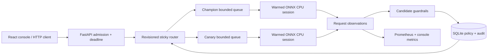

# Switchyard ML

**Serve a model. Release a canary. Break it on purpose. Watch it roll back.**

Switchyard is a working ML serving reference platform: real ONNX inference, bounded dynamic batching, a versioned release policy, and automatic rollback driven by observed candidate errors and latency. The workload is a small CPU digit classifier so the whole failure experiment runs on a laptop without API keys.

[](https://github.com/smfardeen7/switchyard-ml/actions/workflows/ci.yml)

[Explore the recorded console](https://smfardeen7.github.io/switchyard-ml/) · [Architecture and tradeoffs](docs/ARCHITECTURE.md) · [Performance study](docs/PERFORMANCE.md) · [Operations](docs/OPERATIONS.md) · [Interview walkthrough](docs/INTERVIEW.md) · [Verification & screenshot](docs/VERIFICATION.md)

The public console replays **measurements captured from the real API**. Live inference, load generation and release controls run locally. This is a single-instance systems project; it does not claim GPU/LLM serving performance or a distributed production control plane.

## Run the platform

```bash
git clone https://github.com/smfardeen7/switchyard-ml.git
cd switchyard-ml
docker compose up --build
```

Open the console at **http://localhost:8080**, the API documentation at **http://localhost:8090/docs**, and Prometheus at **http://localhost:9090**. Initial startup trains and exports two small models, verifies artifacts and warms both sessions. Compose is a local demonstration with a documented development token; production mode requires an explicit key and disables faults. See [deployment details](docs/OPERATIONS.md).

Without Docker (Python 3.12 and Node 22.12+):

```bash
python3.12 -m venv .venv
source .venv/bin/activate
pip install -r requirements.txt
uvicorn switchyard.api:app --host 127.0.0.1 --port 8090
```

In a second terminal:

```bash
cd frontend
npm ci
npm run dev
```

Follow Vite's local URL. The console proxies requests to port 8090. The local demonstration bearer token is `local-development-only`, already filled in the console; it is held in memory.

## Five-minute failure lab

1. Run sample inference and send a baseline traffic burst. Inspect queue time separately from model execution time.
2. Start a 25% canary for `digits-rf-v2`. Both versions were trained on the same seeded split; the candidate must pass the holdout quality gate.
3. Enable the candidate fault injector, then send traffic. Only requests routed to that canary are affected.
4. After the minimum candidate sample count, an error-rate or p95 breach restores the champion. Inspect the persisted rollback reason and policy revision.
5. Send another burst. It should route entirely to the champion. In-flight requests admitted before rollback can still finish against the old candidate.

Alternatively, run the HTTP recording script documented in [Operations](docs/OPERATIONS.md); it asserts automatic rollback and a successful champion-only recovery phase. The committed [recording](frontend/public/demo.json) contains actual snapshots and request outcomes, not invented chart data.

## What is implemented

| Concern | Evidence in this repository |
|---|---|
| Model lifecycle | Reproducible sklearn digits split, ONNX export/parity checks, SHA-256 verification before session creation, startup warmup/readiness |
| Serving | Separate bounded queue per version, compatible batching, thread-offloaded CPU execution, admission rejection, end-to-end deadlines and cancellation cleanup |
| Release safety | Sticky hash routing, quality gate, optimistic revisions, minimum observation count, rolling error/p95 guardrails, manual and automatic rollback |
| Recovery | SQLite transactions and audit history; restart rolls back any unobserved in-progress canary |
| Observability | Prometheus counters/histograms/gauges, latency percentiles, throughput, queue depth, per-version comparisons and event timeline |
| Delivery | React/TypeScript console, nonroot container, Compose, Kubernetes reference manifests, Python/build/container CI, public recorded demo |
| Measurement | Reproducible batching experiments with sample counts, warmup, concurrency, runtime information and honest tradeoffs |

## Architecture



Each model has one batching worker; inference runs off the event loop. Policy changes and observation decisions execute synchronously on the event loop, with SQLite transactions protecting persisted updates. Use **one API worker and one replica**. See [Architecture](docs/ARCHITECTURE.md) for guarantees and failure boundaries.

## Verify

```bash
.venv/bin/python -m pytest -q
cd frontend
npm ci
npm run build
```

See [Performance](docs/PERFORMANCE.md) for measured engine results and methodology. ONNX model files are regenerated locally and excluded from Git; the registry records their hashes and split lineage. Tests exercise artifact corruption, overload, cancellation, deadlines, shutdown, release conflicts, production fault restrictions and rollback recovery.

Built in September 2026. Dataset: scikit-learn's bundled [Optical Recognition of Handwritten Digits](https://scikit-learn.org/stable/modules/generated/sklearn.datasets.load_digits.html). Code is [MIT licensed](LICENSE).
