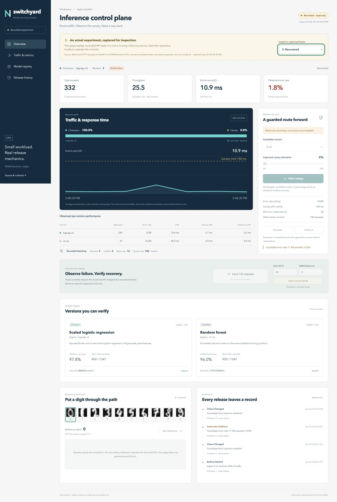

# Verification

## Frontend and browser checks

Performed locally on September 24, 2026 using the actual API and the generated integration recording. No mock measurements were introduced into the console.

- Pinned Prettier 3.9.9 formatted the frontend source and configuration. `npm run format:check` passed; generated `public/demo.json` and the package lockfile were excluded.
- React/TypeScript checking and the live production build passed with `npm run build`.
- The recorded production build passed with `VITE_DEMO_MODE=1 VITE_BASE_PATH=/switchyard-ml/ npm run build`.
- The recorded build loaded at `/switchyard-ml/` with visible capture time, source, and read-only badge. Selecting the Canary fault and Recovered frames changed the displayed captured policy and metrics.
- Inference, rollout, promotion, rollback, traffic exercise and chaos write controls were disabled in recorded mode. The client also rejects writes when compiled in recorded mode.
- The live console rendered model metadata, observed metrics and expandable automatic-rollback evidence. The evidence included sample count, raw error rate, p95 and configured guardrails.
- Desktop and 390px mobile layouts were inspected. At 390px, document scroll width was 390px, with no horizontal page overflow.
- Normal live and recorded rendering produced no browser warning/error entries during inspection.
- The digit picker displays one reference sample per label, 0–9. Queue and inference latency columns are labeled p50 to match the API's median aggregation. Retained-sample truncation is disclosed when reported by the API.

The live workflow was exercised through the browser: real sample prediction, a 25% canary, 50% candidate-only injected errors, and a 120-request burst with 12 workers. The controller rolled back after 20 candidate observations. A subsequent browser-triggered burst completed 120/120 requests successfully on the restored champion.

## Backend and experiment checks

- `python -m pytest -q`: **45 passed** on Python 3.12.14. The remaining warning is Starlette's announced deprecation of its httpx test transport; it does not affect the serving path.
- Tests exercise real ONNX/sklearn probability parity, deterministic model hashes, integrity failures, queue overload, deadlines, cancellation capacity recovery, shutdown, revision conflicts and restart recovery.
- An HTTP concurrency regression holds an old candidate request in flight, rolls back, starts a new rollout, then releases the old failure. The newer rollout remains running.
- Review defects were reproduced and fixed with regression tests: failed startup/shutdown paths now close SQLite, and nonfinite/overflowed JSON numeric inputs return422 without breaking error serialization.
- 6,144 benchmark requests succeeded; zero measured errors. See [methodology and raw results](PERFORMANCE.md).
- The fresh HTTP recording contains332 requests and a persisted automatic rollback;160/160 recovery requests succeeded. Its phase outcomes are separate from the trailing60-second dashboard window.
- Docker Compose configuration and Kubernetes/CI/Prometheus YAML parsed successfully. Local Docker daemon was unavailable; actual container execution is delegated to GitHub CI. Kubernetes execution is not claimed.

The screenshot below is an unedited browser capture of the actual **Recovered** recording frame. It includes the recording badge, capture time, measured metrics and automatic rollback audit history; it is not an illustration or synthetic rendering.

